# 2D Jenga Game

A physics-based Jenga game built with Phaser 3 and Matter.js, featuring pseudo-3D rendering and turn-based gameplay.

## 🎮 Features

- **Physics-based tower**: Realistic block physics using Matter.js
- **Pseudo-3D rendering**: Custom projection system for depth perception
- **Turn-based gameplay**: 2-player local multiplayer
- **Mouse/touch interaction**: Drag blocks to remove them from the tower
- **Win detection**: Game ends when the tower collapses
- **Instant restart**: Quick game reset via button

## 🛠️ Tech Stack

- **Phaser 3.60.0**: Game engine for rendering and input handling
- **Matter.js 0.19.0**: 2D physics engine
- **Vanilla JavaScript**: No build tools required
- **GitHub Pages**: Hosting and deployment

## 🚀 How to Play

1. **Click and drag** a block to pull it from the tower
2. **Release** to complete your turn
3. **Alternate turns** with another player
4. **Avoid collapsing** the tower - the player who causes the collapse loses!
5. **Click Restart** to play again

## 🎯 Game Mechanics

- **Tower structure**: 4 levels, 3 blocks per level (12 total blocks)
- **Alternating orientation**: Blocks alternate between X and Z axis orientation
- **Collapse detection**: Tower collapses when any block rotates beyond 0.5 radians
- **Physics tuning**: Custom friction, density, and air resistance for realistic feel
- **Stability**: Tower includes ground/floor and tuned physics parameters for guaranteed initial stability (tested for 10 seconds)

## 📐 Architecture

### Core Systems

1. **Physics Engine (Matter.js)**
   - Simulates block interactions and gravity
   - Constraint-based dragging system
   - Custom physics parameters for Jenga-like behavior

2. **Rendering (Phaser 3)**
   - Custom pseudo-3D projection
   - Depth-sorted rendering for correct visual layering
   - Quad-based face drawing for 3D block appearance

3. **Projection System**
   - Isometric-style camera with angle and tilt
   - Converts 3D coordinates (x, y, z) to 2D screen space
   - Depth calculation for proper sorting

4. **Input Handling**
   - Point-in-quad picking for block selection
   - Front-to-back picking for correct selection
   - Screen-to-world coordinate conversion for dragging

### Architecture Diagram

```mermaid
graph TD
    A[Browser] --> B[Jenga Game]
    
    B --> C[Phaser 3 Game Engine]
    B --> D[Matter.js Physics Engine]
    B --> E[Game Logic]
    
    C --> F[Scene Manager]
    C --> G[Renderer]
    C --> H[Input System]
    
    D --> I[Physics World]
    D --> J[Body System]
    D --> K[Constraint System]
    
    E --> L[Tower Manager]
    E --> M[Turn Manager]
    E --> N[Game State]
    
    subgraph "Rendering Pipeline"
        G --> O[Projection System]
        G --> P[Depth Sorting]
        G --> Q[Block Renderer]
        
        O --> R[Isometric Camera]
        O --> S[3D to 2D Conversion]
        P --> T[Z-Depth Calculation]
        Q --> U[Quad Face Drawing]
        Q --> V[3D Block Appearance]
    end
    
    subgraph "Physics Components"
        I --> W[Gravity Simulation]
        I --> X[Block Collisions]
        J --> Y[Block Bodies]
        J --> Z[Ground Body]
        K --> AA[Drag Constraints]
        K --> BB[Elastic Connections]
    end
    
    subgraph "Input Processing"
        H --> CC[Mouse Input]
        H --> DD[Touch Input]
        CC --> EE[Block Selection]
        DD --> FF[Touch Dragging]
        EE --> GG[Point-in-Quad Test]
        GG --> HH[Front-to-Back Picking]
        FF --> II[Screen-to-World]
    end
    
    subgraph "Game Systems"
        L --> JJ[Tower Structure]
        L --> KK[Block Creation]
        L --> LL[Stability Check]
        M --> MM[Player Turns]
        M --> NN[Winner Detection]
        N --> OO[Game State]
        N --> PP[Restart System]
    end
    
    subgraph "Tower Structure"
        JJ --> QQ[4 Levels]
        JJ --> RR[3 Blocks per Level]
        JJ --> SS[12 Total Blocks]
        JJ --> TT[Alternating Orientation]
        TT --> UU[X-Axis Blocks]
        TT --> VV[Z-Axis Blocks]
    end
    
    subgraph "Game Rules"
        LL --> WW[Collapse Detection]
        LL --> XX[0.5 Radians Threshold]
        MM --> YY[2-Player Local]
        NN --> ZZ[Collapse Loser]
    end
    
    subgraph "Testing System"
        AAA[Stability Test] --> BBB[3 Second Simulation]
        AAA --> CCC[Collapse Verification]
        DDD[Test Runner] --> AAA
    end
```



## 🌐 Live Demo

[https://franekjemiolo.github.io/jenga-game/](https://franekjemiolo.github.io/jenga-game/)

## 📦 Installation & Local Development

No installation required - the game runs entirely in the browser.

To run locally:
1. Clone the repository
2. Open `docs/index.html` in a web browser
3. Or use a local server:
   ```bash
   python -m http.server 8000
   # Then visit http://localhost:8000/docs/
   ```

## 🧪 Testing

Run the automated stability test:
```bash
npm install
npm run test:stability
```

This test simulates the tower physics for 3 seconds and verifies it remains stable without collapsing.

## 🔄 Deployment

This project uses GitHub Actions for automatic deployment to GitHub Pages:

- **Trigger**: Push to `main` branch
- **Build**: No build step required (static HTML)
- **Deploy**: Automatically deploys `docs/` folder to GitHub Pages
- **Workflow**: `.github/workflows/deploy.yml`

## 🧪 Testing Checklist

### Core Functionality
- [x] Blocks can be selected reliably
- [x] Dragging feels elastic and natural
- [x] Turns alternate correctly
- [x] Collapse condition triggers correctly
- [x] Winner is correctly assigned

### Cross-Device
- [x] Desktop (Chrome, Firefox, Safari)
- [x] Touch drag works on mobile
- [x] No accidental scroll/zoom on mobile

### Performance
- [x] Stable 60 FPS with full tower
- [x] No memory leaks
- [x] Smooth graphics rendering

## 🔮 Future Enhancements

Potential improvements for future versions:
- **Flat 2D view system** (see `CHALLENGES.md` for detailed plan)
  - Front, side, top, and isometric views
  - View switching with keyboard/UI controls
  - Proper 2D physics for each view
- Axis-constrained dragging (real Jenga rule)
- Camera orbit controls
- Center of mass stability visualization
- Hover highlighting
- Sound effects
- Multiplayer online mode
- Block textures and improved visuals

## ⚠️ Known Limitations

The current pseudo-3D system uses Matter.js 2D physics, which cannot properly simulate 3D stacking where blocks at different Z-depths don't collide. The current implementation uses a tiny X-offset workaround for X-orientation blocks to prevent 2D collision overlap. This provides basic stability but is not a true 3D solution. This will be properly solved by the flat 2D view redesign outlined in `CHALLENGES.md`.

## 📄 License

MIT License - feel free to use and modify as needed.

## 🤝 Contributing

This is a personal project, but suggestions and improvements are welcome!

---

Built with ❤️ using Phaser 3 and Matter.js
